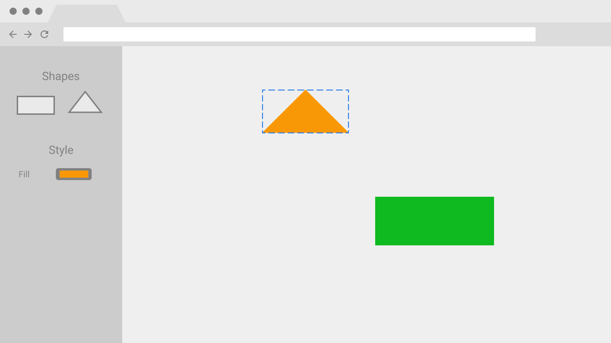

# Примитивный графический редактор

Сделан в качестве тестового задания.

Текст задания потерян, но вот его суть:
- сделать очень простой графический редактор;
- по макету;
- в виде SPA;
- с сохранением состояния.

## Макет

## Результат

[Собранное приложение](http://graphics-editor.stage9.ru/)

## Особенности

### Выделение и перемещение

Как в Фигме:

-   Простой клик по объекту выделяет только его и снимает выделение со всех остальных объектов.
-   Клик с зажатым `Shift` переключает выделение объекта (если было, то снимается, и наоборот). Предыдущее выделение не сбрасывается.
-   Клик срабатывает только в рамках реальной формы объекта.
-   Клик по пустому месту рабочей области снимает выделение.
-   Можно выделить область. Выделяются те объекты, чей контейнер (описанный прямоугольник) пересекается с областью выделения.
-   Если во время начала выделения области нажат `Shift`, то ранее выделенные объекты сохраняют выделение.
-   Если во время выделения области нажат `Shift`, выделение на попавших в область объектах переключается.
-   `Esc` снимает выделение со всех объектов.
-   `Ctrl` + `A` выделяет все объекты.
-   Для перетаскивания выделенных объектов надо зажать кнопку мыши на любом из них и тащить курсор, не отпуская кнопку.
-   Также можно перетаскивать невыделенный объект. Тогда он выделятся, а предыдущее выделение снимается.

### Удаление выделенных объектов

`Del` или `Backspace`

### Сохранение данных

Сохранение происходит через определённое время после последнего изменения и при закрытии приложения.

### Технологии

Проект инициирован при помощи Create React App с шаблоном `redux-typescript`.
